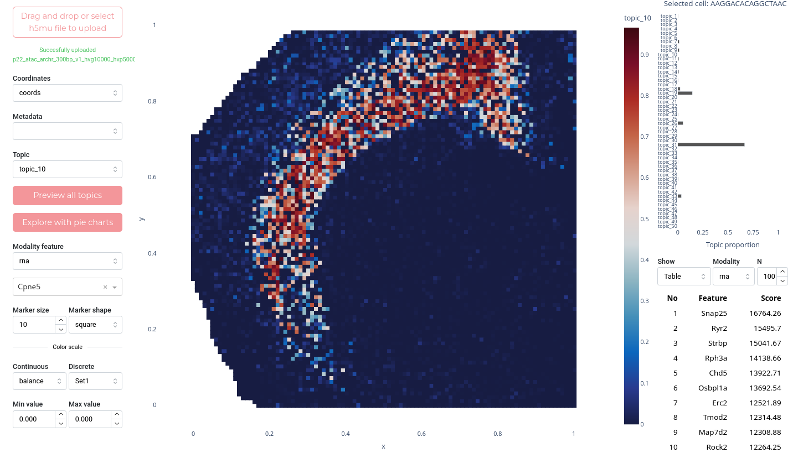

## mTopic Viewer

**mTopic Viewer** is a lightweight dashboard built with the Plotly and Dash Python packages. It enables quick and interactive analysis of results obtained using the mTopic package. Data exploration includes metadata, topic distributions, and features with the highest scores. Users can switch between modalities, view all topics simultaneously, customize chart appearances in various ways (including color palette selection and scaling), and save their work.

A key functionality of mTopic Viewer is the ability to analyze a selected cell or spot, or a user-defined area. Clicking on a cell/spot displays its topic distribution, or the average value across an area if multiple cells are selected. Area selection can be performed using a rectangular region (box select) or, for irregular shapes, the lasso tool.

<p align="center">
  
</p>


## Installation

You can create a virtual environment using `venv` or `conda`. Using `conda` is recommended as it provides a convenient way of configuring a specific Python version — in this case, Python 3.11.2.

### Venv
```bash
python -m venv mtopicenv
source mtopicenv/bin/activate
```

### Conda
```bash
conda create --name mtopicviewer python=3.11.2
conda activate mtopicviewer
```

### Install dependencies

mTopic Viewer relies on several Python libraries. These can be installed using:

```bash
pip install -r /path/to/mtopicviewer/requirements.txt
```

Please replace `/path/to/mtopicviewer/` with the actual path to your mTopic Viewer directory. Ensure the virtual environment is activated before installing the dependencies.

To launch mTopic Viewer, run the following command:

```bash
python /path/to/mtopicviewer/mtopicviewer.py
```

Wait until you see confirmation that Dash is running at `http://127.0.0.1:8080/`, then navigate to this address in your browser.

The default port is **8080**. To use a different port:

```bash
python /path/to/mtopicviewer/mtopicviewer.py --port=8082
```

If the selected port is already in use, the program will not launch. If running multiple mTopic Viewer sessions simultaneously, each must use a unique port.

To terminate the program, stop the `mtopicviewer.py` script using `Ctrl+C` in the terminal.

## Usage

The dashboard layout consists of a main panel (center) and two side panels (left and right):

- **Left panel**: for data upload, coordinate/feature selection, color settings.
- **Main panel**: interactive visualization of topics, metadata, or modality features.
- **Right panel**: shows topic distributions for the selected cell/area and the top features for a selected topic.

### Left Panel

- **Drag and drop or select h5mu file to upload** – Load the dataset. Only `.h5mu` files are supported. The file must contain a dataframe with embedding or spatial coordinates stored in `obsm`. After upload, a status message confirms success or lists any errors. Alternatively, load a file via the `--file` flag when starting the app:
  ```bash
  python mtopicviewer.py --file=/home/work/dataset.h5mu
  ```

- **Coordinates** – Choose from coordinate matrices in `obsm` (excluding the topics dataframe).

- **Metadata** – Select a feature from `obs` to color the plot. The Viewer auto-detects whether the selected feature is continuous or categorical and applies an appropriate color palette.

- **Topic** – Choose a topic to visualize. Data is taken from the `topics` dataframe in `obsm`. This selection also affects the bottom-right panel (top features).

- **Preview all topics** – Generate a static image collating all topics.

- **Explore with pie charts** – View topic distributions for each cell/spot as pie charts. Hover to see a camera icon for saving as PNG.

- **Modality feature** – Choose a modality. Below it, a search box allows you to select a specific feature for visualization.

- **Marker size** – Adjusts the size of the displayed points/spots (default: 8).

- **Marker shape** – Shape of points: "circle" (default) or "square".

#### Color Scale

- **Continuous data palettes** (examples): aggrnyl, magma, viridis, turbo, inferno, etc.

- **Diverging palettes** (examples): balance, rdylbu, spectral, tealrose, etc.

- **Discrete palettes**: Set1, Set2, Set3, Prism, Bold, Vivid, etc.

- **Min/Max value** – Set range limits for the color scale to improve visualization and remove outliers.

> :bulb: The full list of color palettes is extensive. For reference, you may consult [Plotly color scales documentation](https://plotly.com/python/colorscales/).

### Main Panel

The main panel contains an interactive graph that responds to dataset selections. Upon file upload, mTopic Viewer scans the `obsm` slot for available coordinate frames (excluding topics) and uses the first available one by default.

The graph updates automatically when a topic, metadata, or modality feature is selected.

Toolbar (top-right of the graph) options include:
- Download as PNG
- Zoom / Pan
- Box Select / Lasso Select
- Zoom in / Zoom out
- Autoscale / Reset axes

### Right Panel

- **Top**: A bar chart displays topic distributions for a selected cell/spot or the average across a selected area. Select an area using Box or Lasso Select. A camera icon appears on hover to save the chart.

- **Show** – Choose how top features are displayed: "bar plot" (default) or "table".

- **Modality** – Choose the modality from which the top features are drawn.

- **N** – Number of top features to display.

At the bottom of the panel, a plot shows the top features for the selected topic and modality, calculated across the entire dataset (not just the selected area). The figure is downloadable via a hover-enabled camera icon if shown as a bar plot.
